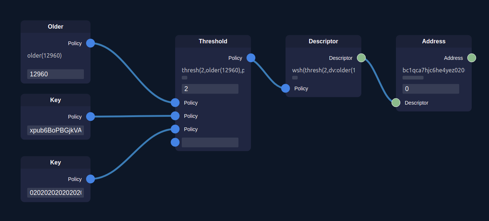

# Miniscript playground

WORK IN PROGRESS

WASM + [rust-miniscript](https://github.com/rust-bitcoin/rust-miniscript) + [rete.js](https://github.com/retejs/rete) = miniscript node editor

Try online: [miniscript.fun](https://miniscript.fun)



## How to build and run

You will need [rust](https://www.rust-lang.org/tools/install) and [wasm-pack](https://rustwasm.github.io/wasm-pack/installer/), then:
```
cd rust
cargo build
wasm-pack build --target web
cd ..
python3 -m http.server
```

You'll see the website on http://localhost:8000

## Roadmap

Planned:

- [x] all policy op-codes
- [x] address derivation
- [x] automatic url encoding of full editor state (`#/full/b64-encoded-json`)
- [x] node inspector with node output
- [x] bip39 and DescriptorKey nodes (mnemonic to root key, then derive with path and select allowed derivation)
- [x] network selector (bitcoin / testnet / regtest / signet)
- [x] export/import file and loading nodes state from external json (`#/url/path/to/config.json`)
- [x] add labels for inputs like threshold, mnemonic, password, derivation path etc.
- [ ] allow aliases for keys (any string instead of a valid (x)pub)
- [ ] add control panel with all nodes
- [ ] add info-description for nodes
- [ ] use sortedmulti instead of multi
- [ ] build nodes from url with policy (`#/policy/andor(blah(blah))`)
- [ ] build nodes from url with descriptor (`#/descriptor/wsh(andor(blah(blah)))`) - uplift?
- [ ] simple miniscript wallet using block explorer
  - [ ] fetch balances
  - [ ] create psbt
  - [ ] finalize psbt
  - [ ] Specter-DIY QR support
- [ ] allow xprv and WIF keys?
- [ ] taproot and tapscript
- [ ] wpkh, sh(wsh), sh(wpkh)
